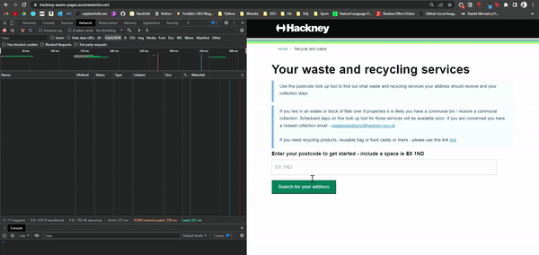

Title: Building a bin collection reminder bot in Python
Date: 2022-04-01 09:31
Category: Python
Tags: Requests, JSON
Author: Freddie Larkins
Summary: Python is great for automating repetitive tasks, such as checking bin collection. I built a friendly Bin Bot to do just that.
Slug: building-a-bin-collection-reminder-bot-in-python
<!--Status: draft-->

**Sunday nights in our house involve a weekly ritual.**

First, we remember bins are due the following morning. Second, we realise we've forgotten what was collected the previous week. Third, we check the council's [HackneyWaste bin-checker tool](https://hackney-waste-pages.azurewebsites.net/) to see what bins are due.

What if there was a better way?

Well, with Python, there is!

Using the [Requests](https://docs.python-requests.org/en/latest/) library, we can mimic the series of http requests that your browser makes when using the HackneyWaste tool...



<center>_Keep your eye on the DevTools panel on the left-hand side. Our precious requests!_</center>

...and we can get all the data you see rendered in your browser in JSON. We can use that data to send automatic reminders for what bins are being collected, alleviating the need to repeat the aforementioned ritual. Neat!

You can check out the repo below:

<div class="github-card" data-github="fredlarkins/hackney-bin-bot" data-width="400" data-height="" data-theme="default"></div>
<script src="//cdn.jsdelivr.net/github-cards/latest/widget.js"></script>

I'll run through some of the interesting challenges I when building the bot.

---
[TOC]

---

## Challenges

When I first started on this project, I actually set out to build something in Selenium. I'd load up the HackneyWaste tool the in a headless browser and use a mixture of `browser.find_element()` the `browser.send_keys()` to run through the same flow that a real user would:

 1. Input postcode
 2. Hit Enter on <button>Search for your address</button>
 3. Select address from dropdown
 4. Hit Enter on <button>Go</button>
 5. Scrape the resulting bin collection data using BeautifulSoup
 
 However, I didn't feel that would really teach me much about how the application worked. Nor would I gain any experience in scraping data from the backend - as it were - rather than the frontend.
 
So, I had to figure out how those series of requests led from this:


To this:


### Working out how the series of requests fit together

I've no shame in admitting it took me a while to get this right! 

I figured it would make sense to run through the flow as a user would, seeing which requests pertain to each step in the flow.


#### 1. Sending a postcode / choosing address
The first couple of requests are `POST` requests to the first server, `18.169.89.254`. It receives the user's postcode and returns the street addresses for the user to select. 

`CTRL-F` was by best friend here: I could see that the postcode was buried deep in the request body. When testing this first step with other postcodes, I could see that nothing else changed in the lines and lines of JSON - just the postcode.

The response contains data for each of the addresses, such as street address and Basic Land and Property Unit class codes (I had to Google what those were - *tl;dr* they're not relevant for bin collections).

The _relevant_ bit of information for each property is the `itemId`. This alphanumeric code uniquely identifies each property:
```
itemId: "5f898d4790478c0067f8c316"
```
The user selects their address from the dropdown list; the application then uses that home's `itemId` in the next request to a second server, `3.10.72.124`, to query what bin collections apply to that property.

#### 2. Retrieving the bin collection services for the address

The next request is a `GET` request to server 2 (used for all subsequent requests), asking for the bin collection services applicable to that specific address. Not all addresses in Hackney have collections, and collection days vary by street. 

The `itemID` we just obtained is used in the endpoint for this `GET` request:

<pre><code>https://api.uk.alloyapp.io/api/item/<b>5f898d4790478c0067f8c318</b>?token=67ad2108-dd2b-407a-849a-411a15adf0b1</code></pre>

There is one field in the JSON response that we're interested in: `attributes_wasteContainersAssignableWasteContainers`. This field contains a list of up to four new alphanumeric values, each of which represents a 'waste container' - i.e. recycling, food waste, black bins or garden waste. So far, the workflow looks a bit like this:


For each value returned, the browser makes a request using the same scheme above (appending the `id` for the waste container to the endpoint) to map that value to a 'human-readable' service. So, for this property:
```text
5fa55c586b4fb500650caf08 ---> Recycling Sack
5faea1a108c64000672a88fe ---> Food Caddy (Small)
```
And so on.

#### 3. Retrieving the collection schedules for each waste service

This next bit is a bit confusing, and seems to me somewhat inefficient. Anyway.

The browser makes a `POST` request for each `id`  obtained above.

What we want in return is the value for `attributes_scheduleCodeWorkflowID_5f8dbfdce27d98006789b4ec`. This gives us the `id` for the collection timetable, which we retrieve by hitting an endpoint _containing_ that timetable `id` For instance:
```text
5fa55c586b4fb500650caf08    # the id for Recycling Sack
```
Gives us:
```text
workflows_testWorkflowRoundM1Mon_5f8dea39e27d98006789b99f	# the id for the recycling collection schedule
```
Incorporating the above `id` in the endpoint for our `GET` request gives us:
<pre><code>https://api.uk.alloyapp.io/api/workflow/<b>workflows_testWorkflowRoundM1Mon_5f8dea39e27d98006789b99f</b>?token=67ad2108-dd2b-407a-849a-411a15adf0b1</code></pre>

...which returns a JSON response with the timetable for that waste container:
```javascript
{
    "workflow": {
        "workflow": {
            "name": "Workflow_Round Mon",
            "enabled": true,
            "trigger": {
                "dates": [
                    "2020-04-13T00:00:00.000Z", // our timetable data
                    "2020-04-20T00:00:00.000Z",
                    "2020-04-27T00:00:00.000Z",
                    ...
                    "2024-01-01T01:01:00.000Z"
                    ],
// and lots of other superfluous json...     
```
Rinse and repeat for each waste container  (recycling, food waste etc.) available for that address.

Represented visually, the flow looks like this:


It seems like there are lots of unnecessary requests in this flow. But who knows; I'm not one to tell developers how to do their jobs!

Anyways, we've finally got what we want: the collection timetables for each waste service. But how to use that data to send alerts?

---
## Setting up a Cron Job to send bin-collection alerts

I scratched my head about this one for a while as well.

I settled on the solution of running a daily script as a [Cron Job](https://ostechnix.com/a-beginners-guide-to-cron-jobs/) - basically a scheduled command - that loops through each timetable, subtracting every date listed from the present date. If the difference equals 1, the collection is the following day:

```python
collection_is_due_tomorrow = []
    # looping through the timetable, getting the difference between today's date and the date in that iteration of the loop
    for date in timetable:
        
        # if it's the day before collection is due, this value will equal 1
        if (date - today).days == 1:
			
			# append the waste container to the 'collection_is_due_tomorrow' list
            collection_is_due_tomorrow.append(waste_container)
```

The script composes a simple email including what is due the following day, and sends it to the email addresses provided when running `check-bins.py` for the first time.

This is the email I received last Sunday:


And that's it! The Bin Bot's got us covered.

---
## Learnings
I've done a bit of web scraping before, but this was the first time I tried to circumvent the front-end and go straight to the network requests to get the data I was after. So I'm definitely no expert. But I learned a fair bit from this exercise that'll hopefully serve me well in the future.

### 1. Use a Text Comparison tool to tease out which bits of request bodies / responses are important.
 At first, I was slightly overwhelmed by the JSON I was sending and receiving. I couldn't work out which bits mattered, and which stayed the same no matter what address I was using. Text Compare tools could help me isolate the important variables.

Take these two identical looking `POST`-request bodies:
 
 

Highlighted in blue, the only thing that is different between them is that very last value. From that, I know that bit of information is important, and likely explains why I get two different responses. You can use that approach with any two requests that look similar to zero in on the information that the server really needs.

### 2. Throttle DevTools to slow a series of requests down.
Part of this challenge was understanding how a series of up to fifteen requests fit together. Slowing them down helped me to get a sense of what request was governing the visual data I could see trickling through on the page:


### 3. If you can't work it out, step away and do something else.
I w̶a̶s̶t̶e̶d spent hours trying figure out how this application worked. Often, though, I found that I made a breakthrough when I'd stepped away from my laptop for a few hours or days. It's a bit of a cliché, but it really does help your brain reset and come at the project with a fresh set of eyes.

---
*P.S. Hackney Council: if you're reading this, please don't change your backend. My Bin Bot won't like it 🙃*